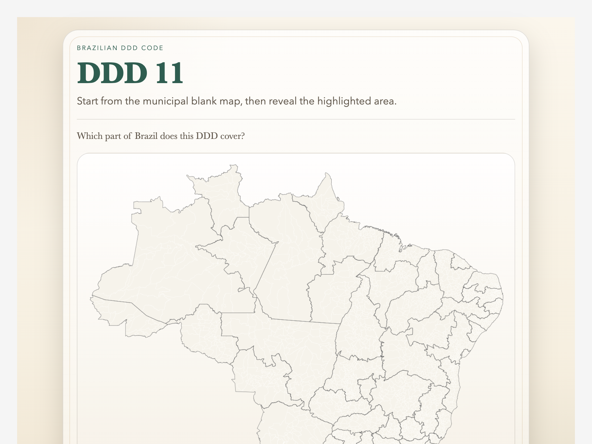

# brazil-ddd-codes

[](https://github.com/ritornello-labs/brazil-ddd-codes/actions/workflows/anki-workbench.yml)
[](https://ankiweb.net/shared/info/1860702413)

[](LICENSE)

An Anki deck generator workspace for Brazil's `DDD` telephone area codes, with an emphasis on map-based recognition cards and reproducible media generation.



## Download

Install the shared deck from [AnkiWeb](https://ankiweb.net/shared/info/1860702413).

## Goals

- start from a verified public source map with clear provenance
- derive a blank Brazil base map without labels or color-coded DDD groupings
- generate locator maps for individual DDD codes in a consistent style
- keep exported assets small enough to render comfortably in Anki, including on mobile
- make the deck reproducible from checked-in manifests and scripts rather than manual graphic edits

## Repository layout

- `data/raw/map_asset_sources.csv`: source-map provenance manifest
- `data/raw/reference_data_sources.csv`: source-table provenance manifest
- `data/README.md`: notes about reference tables and manifests
- `media/README.md`: notes about source, derived, and export assets
- `scripts/fetch_map_assets.py`: downloads source media from the manifest
- `scripts/fetch_reference_data.py`: downloads and extracts the official municipality-to-CN reference table
- `scripts/inspect_source_svg.py`: inspects the original SVG structure for reusable map-generation hooks
- `scripts/generate_maps.py`: generates blank-map and locator-map assets
- `scripts/build_apkg.py`: builds the Anki package with the two DDD card templates
- `DDD_NOTE_TYPE.md`: note fields and card-template contract
- `DDD_DECK_PLAN.md`: current scope and build plan

## Build workflow

Install dependencies:

```sh
uv sync --extra deck
```

Fetch the source SVG:

```sh
.venv/bin/python scripts/fetch_map_assets.py
```

Inspect the SVG structure:

```sh
.venv/bin/python scripts/inspect_source_svg.py
```

Fetch the official CN reference table:

```sh
.venv/bin/python scripts/fetch_reference_data.py
```

Generate blank and locator maps:

```sh
.venv/bin/python scripts/generate_maps.py
```

By default, the generator writes:

- one blank municipal SVG and PNG base map
- one state-outline-only SVG and PNG base map
- one PNG locator map per `DDD`
- one `ddd_codes.csv` summary table derived from the official reference data

The script can also emit per-`DDD` SVGs, but those are intentionally optional because they remain very large when derived from the full municipal source geometry.

Build the deck package:

```sh
.venv/bin/python scripts/build_apkg.py
```

Output:

- `out/brazil-ddd-codes.apkg`

## Primary source

- Wikimedia Commons: [File:Mapa do Brasil por código DDD.svg](https://commons.wikimedia.org/wiki/File:Mapa_do_Brasil_por_c%C3%B3digo_DDD.svg)

The source file is licensed under CC BY-SA 4.0 and attributes `João Vitor Bachini`.

## License

Repository code and documentation are MIT licensed. Source maps and reference data keep their upstream licenses and attribution requirements as documented in the data manifests.
